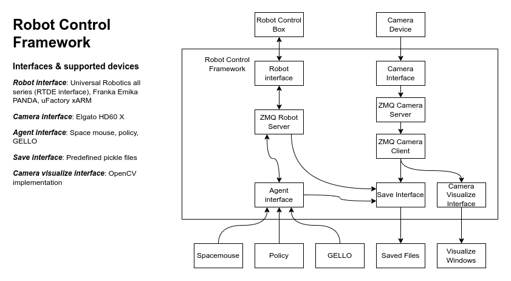

# Quick references

## System Overview



## Configurations

### TCP

The flange towards Z+, tool connection towards Y- (GoPro installing direction).

TCP:
```
X: 0 mm
Y: 0 mm
Z: 267.13 mm
Rx: 0 rad
Ry: 0 rad
Rz: 0 rad
```

### Mass and CoM

Mass:
```
1.730 kg
```

CoM:
```
CX: 0 mm
CY: -16.00 mm
CZ: 66.00 mm
```

## Saved data format

Observation in each timestamp will be saved as one pickle file (see ```format_obs.py``` for detail).

Observation is a dictionary. The key and format depends on types of agents, robots and cameras, but basically contains:

**'timestamps' (datetime.datetime)**: Timestamp. Describes in '%Y-%m-%dT%H:%M:%S.%f' format (POSIX).

**'wrist_rgb' (np.ndarray, (720, 960, 3))**: RGB frame of wrist camera. Describe in RGB format, ranged within [0, 255].

**'joint_positions' (np.ndarray, (7,))**: Robot joint positions concatenated with gripper position. Describes in [Jpos1, Jpos2, Jpos3, Jpos4, Jpos5, Jpos6, Gpos] format.

**'joint_velocities' (np.ndarray, (7,))**: Robot joint velocities concatenated with gripper velocity. Describes in [Jvel1, Jvel2, Jvel3, Jvel4, Jvel5, Jvel6, Gvel] format.

**'control' (np.ndarray, (7,))**: Control signals corresponds to robot state. Describes in positions of robot joint space [Jpos1, Jpos2, Jpos3, Jpos4, Jpos5, Jpos6, Gpos].

**'ee_pose' (np.ndarray, (6,))**: End-effector pose in robot frame. Describes in [X, Y, Z, Rx, Ry, Rz] format.

**'ee_pos_quat' (np.ndarray, (7,))**: End-effector position concatenated with quaternion. Describes in [X, Y, Z, 1, i, j, k] format.


## Scenarios

### Running a real UR robot, a wrist camera node and controlling the robot by space mouse and enabling visualize camera frames.

Open 3 terminals, enter the commands in individual terminal.
```
python experiments/launch_nodes.py --robot=ur --robot_ip=192.168.10.4
python experiments/launch_camera_nodes.py 
python experiments/run_env.py --agent=spacemouse --visualize-camera-obs
```

### Running a real UR robot, a wrist camera node and controlling the robot by space mouse and enabling save data.

Open 3 terminals, enter the commands in individual terminal.

Press "s" to start data recording, press "q" to stop data recording.
```
python experiments/launch_nodes.py --robot=ur --robot_ip=192.168.10.4
python experiments/launch_camera_nodes.py 
python experiments/run_env.py --agent=spacemouse --use-save-interface --data-dir=[saved data directory]
```

